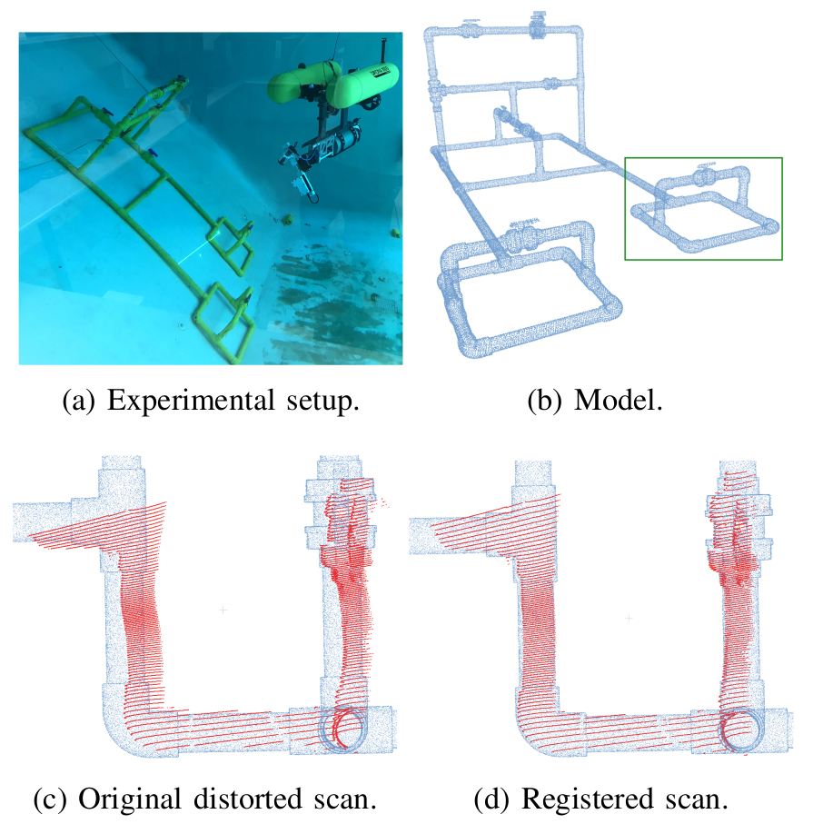

# Linewise Non-Rigid Registration (LNRR)


This repository provides a basic implementation of the non-rigid point cloud registration method described in [1].
For a detailed explanation of the method and its motivation, please refer to the [original paper](https://doi.org/10.1109/LRA.2022.3180038).
In a nutshell, the method is able to find the set of rigid transformations that need to be applied to *each line* in the scan in order to match an existing model:



You can also watch the video that summarizes this work:

[](https://youtu.be/4QDZ7z1WER8)

Additionally, you can watch the presentation of this work at IROS 2022:

[](https://youtu.be/tp0ob9yHagQ)

Thank you for citing the original publication [1] if you use our method in academic work:
```
@ARTICLE{9788023,  
  author={Castillón, Miguel and Ridao, Pere and Siegwart, Roland and Cadena, César},
  journal={IEEE Robotics and Automation Letters},
  title={Linewise Non-Rigid Point Cloud Registration},
  year={2022},
  volume={7},
  number={3},
  pages={7044-7051},
  doi={10.1109/LRA.2022.3180038}}
```

If you want to know more about our underwater 3D scanner, check out [the paper](https://doi.org/10.1109/TMECH.2022.3170504) [2] and [this blog post](https://miguelcastillon.github.io/project/underwater-3d-scanner/).

## Publications

[1] M. Castillón, P. Ridao, R. Siegwart and C. Cadena, "Linewise Non-Rigid Point Cloud Registration," in IEEE Robotics and Automation Letters, doi: 10.1109/LRA.2022.3180038. [[pdf](https://doi.org/10.1109/LRA.2022.3180038)]

[2] M. Castillón, J. Forest and P. Ridao, "Underwater 3D Scanner to Counteract Refraction: Calibration and Experimental Results," in IEEE/ASME Transactions on Mechatronics, doi: 10.1109/TMECH.2022.3170504. [[pdf](https://doi.org/10.1109/TMECH.2022.3170504)]


## Installation

### Dependencies

Our methods depends on [CMake](https://cmake.org/), [Eigen](http://eigen.tuxfamily.org/index.php?title=Main_Page), and [Ceres](http://ceres-solver.org/index.html) [please note that so far, it has only been tested on Ubuntu 20.04 + Eigen 3.3.7 + Ceres 2.1.]
Moreover, our method uses Fast Gauss Transforms to compute the correspondence probability between each pair of points.
Therefore, our method depends on
[fgt](https://github.com/miguelcastillon/fgt_threshold), which is a fork of [this repository](https://github.com/gadomski/fgt).

In summary, first do:
```bash
sudo apt install cmake libeigen3-dev
```
Then, in your `libraries` folder, compile Ceres:
```bash
git clone https://ceres-solver.googlesource.com/ceres-solver
cd ceres-solver && mkdir build && cd build
cmake .. \
    -DBUILD_TESTING=OFF \
    -DBUILD_EXAMPLES=OFF
make -jX 
sudo make install
cd ../..
```
Then compile fgt:
```bash
git clone https://github.com/miguelcastillon/fgt_threshold
cd fgt_threshold && mkdir build && cd build
cmake .. \
    -DCMAKE_BUILD_TYPE=Release \
    -DWITH_OPENMP=ON \
    -DBUILD_SHARED_LIBS=ON \
    -DWITH_TESTS=OFF
make -jX 
sudo make install
cd ../..
```

### Compilation
As usual, just download and unzip this repository in your preferred location and `cd` into it.
Then:
```bash
git clone https://github.com/miguelcastillon/lnrr
cd lnrr && mkdir build && cd build
cmake [OPTIONS] .. 
make -jX 
sudo make install
```

There are several options that you can pass to CMake:
- `-DCMAKE_BUILD_TYPE=Debug` to get information for each iteration (default is Release).
- `-DBUILD_TESTS=OFF` to disable the compilation of the tests (default is ON).

If at any point you want to uninstall the library, just do:
```bash
sudo make uninstall
```


## Usage

```cpp
#include <lnrr/scan_to_model.h>

int main(int argc, char** argv) {
    lnrr::Matrix fixed = loadModel();
    lnrr::Matrix moving = loadScan();
    lnrr::Vector line_sizes;  // Vector containing the number of points in each line
    double beta = ...;
    double lambda = ...;

    lnrr::ScanToModel lnrr(fixed, moving, beta, lambda, line_sizes);
    lnrr::Result result = lnrr.run();
    return 0;
}
```

And your `CMakeLists.txt` should include:
```cmake
find_package(OpenMP REQUIRED)
find_package(Ceres REQUIRED)
find_package(Fgt REQUIRED)
find_package(Lnrr REQUIRED)

add_library(my-new-library
    my_program.cpp
    )
target_link_libraries(my-new-library
    PUBLIC
    Lnrr::Library-C++
    )
```

Check the folder `examples` to see how to write a `.cpp` file and a `CMakeLists.txt` for your project.

### Example

There is an example in the `examples` folder.
Inside, you can run
```bash
mkdir build 
cd build 
cmake .. 
make -jX
```
Then, from `examples/build` you can run it like this:
```bash
./lnrr_example \
    ../data/model.pcd \
    ../data/scans/ \
    ../data/output.pcd \
    5 \
    30000 \
    0.03
```

Converting between `.pcd` and `.txt` files is easy using PCL, but the code is not added here to limit the number of dependencies.

## Contributing

Please feel free to create [issues](https://github.com/miguelcastillon/lnrr/issues) and [pull requests](https://github.com/miguelcastillon/lnrr/pulls), they will be much appreciated.

## Documentation

Please be aware that this repository is only a simple implementation of the method and may therefore unfortunately not always show a robust behaviour.
There is no documentation yet but we hope the code is self-explanatory.

## License

This library is GPL2, copyright 2022 Miguel Castillón. See LICENSE.txt for the full license text.

In the creation of this library we have drawn inspiration from [this cpd implementation](https://github.com/gadomski/cpd) by Gadomski.
