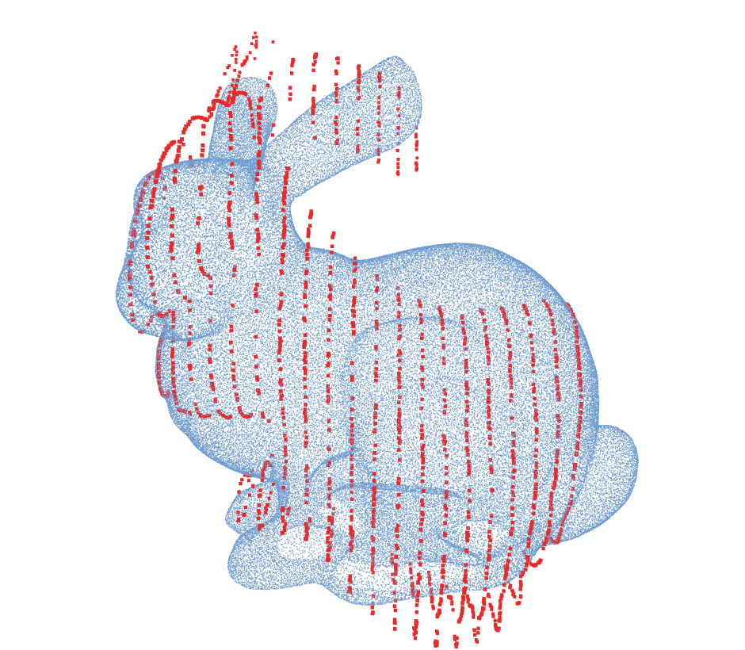
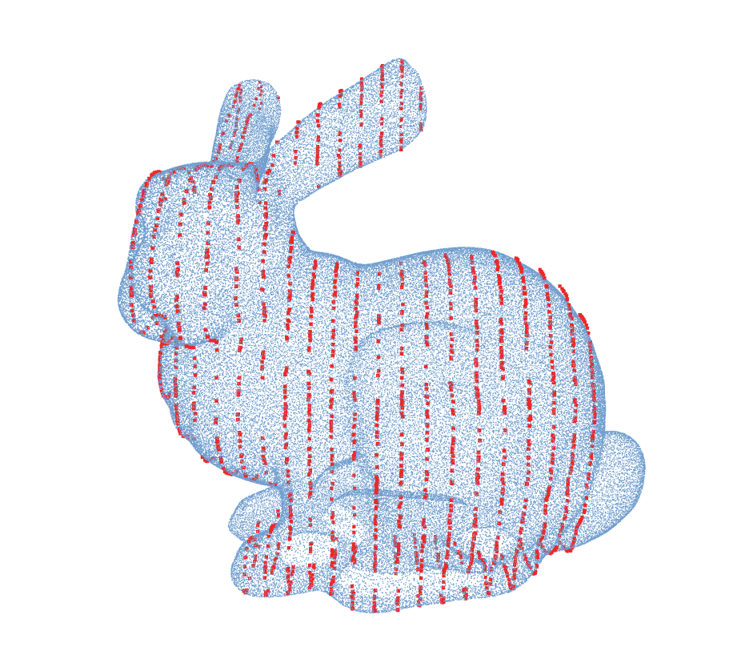

# Linewise Non-Rigid Registration (LNRR)

[fgt](https://github.com/gadomski/fgt)

[cpd](https://github.com/gadomski/cpd)

[Andriy Myronenko](https://sites.google.com/site/myronenko/research/cpd)

[original paper](https://arxiv.org/pdf/0905.2635.pdf) published by Myronenko in 2009

This code lives [on Github](https://github.com/miguelcastillon/cld).





## Installation

```bash
mkdir build
cd build
cmake ..
make
```

### Dependencies

[CMake](https://cmake.org/), [Eigen](http://eigen.tuxfamily.org/index.php?title=Main_Page), and [Ceres](http://ceres-solver.org/index.html).

Only tested with:
- Ubuntu 20.04
- Eigen 3.3.7
- Ceres 2.0

## Usage

```cpp
#include <lnrr/scan_to_model.h>

int main(int argc, char** argv) {
    lnrr::Matrix fixed = load_points_from_somewhere();
    lnrr::Matrix moving = load_points_from_somewhere();
    lnrr::ScanToModel lnrr();
    lnrr.setFixed(fixed);
    lnrr.setMoving(moving);
    lnrr::Result result = lnrr.run();
    return 0;
}
```


**cpd** provides CMake export targets that you can import and use in your own project:

```cmake
find_package(Cld REQUIRED)
add_library(my-great-library
    my_program.cpp
    )
target_link_libraries(my-great-library
    PUBLIC
    Cld::Library-C++
    )
```

## Contributing

Github [issues](https://github.com/miguelcastillon/cld/issues) and [pull requests](https://github.com/miguelcastillon/cld/pulls), per usual.

## Publications

- ToDo
Please cite as:
```
@article{castillon2022,
  title={Linewise Non-Rigid Registration},
  author={Castill{\'o}n, Miguel and Ridao, Pere and Siegwart, Roland and Cadena, C{\'e}sar},
  publisher={IEEE}
}
```

## License